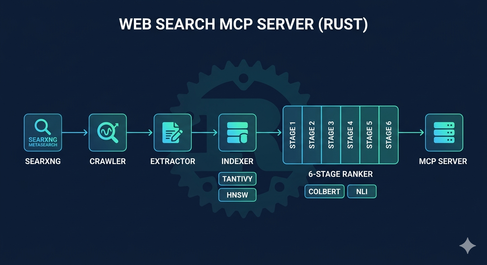
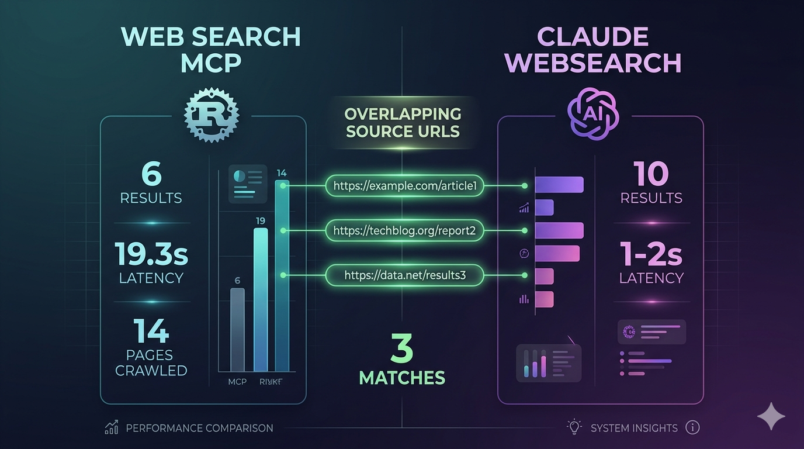

# Web Search MCP Server

A self-contained, API-free web search engine built in Rust that runs as an MCP (Model Context Protocol) server. Crawls, indexes, and ranks web content directly — no Google API, no Bing API, no external search dependencies. Uses neural ML models for semantic understanding, cross-encoder reranking, ColBERT late-interaction scoring, and NLI-based contradiction detection to provide verified, grounded results that prevent LLM hallucination.

## What It Does

- **SearXNG fast path (primary)** — fetches SearXNG JSON API directly (~300ms), then crawls result URLs concurrently. Bypasses slow frontier queue and 15+ SERP page fetches. `docker run -d -p 8080:8080 searxng/searxng` for instant setup
- **SearXNG snippet-only mode** — `instant_search` ranks SearXNG title+snippet directly without any crawling. Results in ~1.5s
- **Concurrent URL fetch** — `FuturesUnordered` fetches all result URLs in parallel with 4s per-request timeout. No frontier queue overhead
- **Crawls the web directly** — fallback to 13 search engine parsers (Google, Bing, Brave, Mojeek, DuckDuckGo, Wikipedia, ArXiv, Reddit, HN, Google Scholar, PubMed) when SearXNG unavailable
- **ColBERT late-interaction reranking** — mxbai-edge-colbert-v0-17m (48-dim, INT8 ONNX) replaces slow cross-encoder for Stage 2. MaxSim scoring: ~5-10ms for 50 docs vs ~8s with cross-encoder (160-400x speedup). Feature-gated (`--features onnx`)
- **SPLADE sparse retrieval** — semantic term expansion via Splade_PP_en_v1 ONNX. Augments BM25 with vocabulary-level relevance weights. Feature-gated (`--features onnx`)
- **Persistent disk cache (redb)** — embeddings + cross-encoder scores survive restarts. Pure-Rust embedded KV store, write-behind flush every 30s, TTL-based eviction
- **Background crawl daemon** — pre-indexes content before queries arrive. Priority queue with domain-level backoff, populates URL cache from discovered links
- **Streaming search pipeline** — progressive results: partial at 3s (fast extraction), refined at 10s (full ranking pipeline). Two-tier deadline via mpsc channels
- **Index-first retrieval** — searches persistent Tantivy + HNSW index before crawling. If fresh results exist (<24h), returns instantly — no crawl needed
- **Query-term relevance gate** — Stage 0 filter rejects candidates with <30% distinctive query-term overlap before expensive CE/ColBERT scoring. Prevents irrelevant pages from polluting results
- **Primary source boost** — 200+ entity-to-domain mappings (AI, GPU, cloud, languages, frameworks). Official domains boosted up to 4.5x (2.5x domain-in-query x 1.8x canonical)
- **Semantic query cache** — caches results by query embedding similarity (cosine > 0.92 = cache hit). Similar queries return instantly (<1s). 4-hour TTL
- **HTTP response caching** — LRU cache (moka) with 10-minute TTL avoids re-fetching, captures ETag/Last-Modified for conditional requests
- **FuturesUnordered streaming crawler** — processes pages as they arrive (no head-of-line blocking), 8-16 concurrent workers
- **Headless browser fallback** — optional chromiumoxide integration for JS-rendered pages (SPA detection triggers automatic browser rendering)
- **Extracts clean content** — parallel 2-pass consensus extraction (Readability + Trafilatura via rayon) with CSS/JS sanitization
- **Batch embeddings** — two-phase processing: extract+index (no ML), then single batched embed() call for all pages at once
- **Query-focused MMR + TextRank synthesis** — hybrid summarization: TextRank graph scoring + query-biased MMR selection
- **ONNX Runtime cross-encoder** — optional ONNX backend with INT8 quantized models. 5-10x faster than Candle FP32. Feature-gated
- **Cross-encoder with pooler** — properly loads BERT pooler layer (tanh(dense(cls))) + classification head. Supports both single-linear (ms-marco) and MLP (NLI) architectures
- **NLI contradiction detection** — nli-MiniLM2-L6-H768 with two-layer MLP classification head (dense + out_proj). Classifies claim pairs as entailment/contradiction/neutral
- **Dual-mode ranking** — fast path (BM25-only, ~10ms) for SearXNG queries, full pipeline (CE + NLI + diversity) for deep research. Embedding skipped on fast path (saves ~6s)
- **6-stage anti-hallucination pipeline** — query-term gate, RRF fusion, ColBERT/CE rerank, authority scoring with primary source boost, NLI contradiction detection, xQuAD diversity
- **Neural embeddings** — all-MiniLM-L6-v2 via Candle (pure Rust, no Python) for semantic search, with content-hash embedding cache
- **Persistent storage** — tantivy index + HNSW vectors + redb cache + dedup state with TTL survive across sessions
- **Works with any LLM** — standard MCP protocol over stdio

## Architecture



```
                         MCP Server (stdio, 15 tools)
                         Progress + Streaming Events
                              |
                         Orchestrator
                    /     |     |     \        \
              Crawler   Extractor  Indexer    Ranker      Daemon
                 |         |         |          |           |
           Streaming    Parallel   Tantivy   6-Stage     Background
           Futures      2-Pass     HNSW      Pipeline    Crawl Queue
           Unordered    (rayon)    SimHash    ColBERT     Priority
           LRU Cache    CSS/JS     Dedup     Cross-Enc   Domain Backoff
           SearXNG      Sanitize   redb      NLI         Pre-index
           13 Search    Language   Persist   Authority      |
           Engines      TextRank   SPLADE    Diversity   Embedder
           Browser      NER        TTL       Gate        Batch Embed
           Fallback     Metadata   Staleness Primary     MiniLM-L6
           Robots.txt   Chunker    Tracking  Source      SPLADE
           Pagination                                    ColBERT
```

### 8 Crates

| Crate | Purpose |
|-------|---------|
| `common` | Data models, config (incl. `searxng_url`), errors, logging |
| `crawler` | FuturesUnordered streaming crawler (8-16 workers), LRU response cache, 13 search engine parsers (incl. SearXNG localhost detection), browser fallback, parser health monitoring, SPA detection, robots.txt, rate limiting, pagination |
| `extractor` | Parallel 2-pass extraction (rayon), CSS/JS sanitization, language detection (11 languages), metadata, JSON-LD, tables, snippet extraction, chunking |
| `indexer` | Tantivy full-text with SPLADE `splade_body` field (disk-backed) + HNSW vectors (bincode) + SimHash/dedup with TTL + staleness tracking |
| `embedder` | CandleEmbedder (neural, batch embed) + HashEmbedder (fallback) + CrossEncoder (reranking with pooler + MLP head) + ColBERT (MaxSim, ONNX) + SPLADE (sparse, ONNX) |
| `ranker` | 6-stage anti-hallucination ranking pipeline with ML models, 200+ entity-domain mappings, primary source boost |
| `orchestrator` | Batch processing, TextRank synthesis, query reformulation, persistent cache (redb), background crawl daemon, streaming pipeline, progress broadcasting |
| `mcp-server` | MCP protocol layer with 15 tool definitions, concurrent tool calls, daemon startup, shutdown flush |

## 15 MCP Tools

### Smart Tools (high-level research)

| Tool | Description |
|------|-------------|
| `instant_search` | Ultra-fast search (**~1.6s**). SearXNG snippet-only mode — ranks title+snippet from SearXNG JSON, zero crawling. Best for simple factual queries |
| `quick_search` | Fast search (**~5s** cold, **~0.2s** cached). SearXNG fast path: concurrent URL fetch + BM25 ranking. Falls back to full crawl if SearXNG unavailable |
| `streaming_search` | Progressive results: partial at ~3s (fast extraction), refined at ~10s (full ranking pipeline). Best when you want results ASAP |
| `deep_research` | Multi-wave crawl across hundreds of pages with full CE/NLI ranking pipeline. Returns verified results with confidence scores and contradiction detection |
| `explore_topic` | Discovery mode — broadly explores a topic, builds entity connections |
| `verify_claim` | Fact-checking — searches for evidence supporting or contradicting a claim |
| `compare_sources` | Side-by-side content comparison from multiple URLs on a specific aspect |

### Atomic Tools (fine-grained control)

| Tool | Description |
|------|-------------|
| `fetch_page` | Fetch raw content from a URL with retry, anti-blocking headers, and SPA detection |
| `extract` | Extract clean text using 2-pass consensus with CSS/JS sanitization |
| `follow_links` | Follow links from a page, optionally filtered by URL pattern or anchor text |
| `paginate` | Auto-detect and follow pagination (5 patterns) |
| `search_index` | Query the persistent local full-text index. Reports document age and warns on stale results (>24h) |
| `find_similar` | Find semantically similar content using neural vector embeddings (MiniLM-L6) |
| `get_entities` | Extract named entities using regex patterns and capitalized phrase detection |
| `get_link_graph` | Map outgoing links from a URL with anchor text and external/internal classification |

## Anti-Hallucination Pipeline

```
Stage 0: Query-Term Relevance Gate                       ~0ms
         Rejects candidates with <30% distinctive query terms
         Stop-word filtering (60+ common words excluded)
         Prevents irrelevant pages from reaching ML stages

Stage 1: Dual Retrieval + RRF Fusion                     ~5ms
         BM25 (tantivy + SPLADE body) + Vector (HNSW/MiniLM-L6)
         Reciprocal Rank Fusion: score = Sigma 1/(60 + rank_i)
         Top-50 candidates

Stage 2: ColBERT / Cross-Encoder Rerank                  ~5-50ms
         ColBERT (primary): mxbai-edge-colbert-17m INT8 ONNX
           MaxSim scoring, 48-dim token embeddings, ~5-10ms
         Cross-encoder (fallback): ms-marco-MiniLM-L-6-v2
           With BERT pooler + classification head, ~50ms
         Score cache: DashMap + redb persistent disk cache
         Top-15 scored

Stage 3: Authority + Freshness + Primary Source          ~1ms
         3a. TrustRank via domain tier (120+ domains)
         3b. Primary source boost (200+ entity-domain mappings)
             Up to 4.5x boost for official/canonical domains
         3c. Adaptive freshness decay per query type
         3d. Query anchor penalty (0.5x for missing all query terms)

Stage 4: Anti-Hallucination Layer                        ~15ms
         A. Cross-reference validation (3+ sources = Verified)
         B. NLI contradiction detection (MLP classification head)
            Pairwise entailment/contradiction/neutral
         C. Echo chamber detection (unique source organizations)
         D. Numeric contradiction heuristic (20% threshold)
         E. Claim-source attribution mapping

Stage 5: Diversity Filter                                ~3ms
         Query-relevant snippet extraction
         SimHash near-duplicate removal (hamming <= 3)
         MMR reranking (lambda=0.7 relevance vs diversity)
         Max 2 results per domain, min 3 unique orgs
```

### ML Models (auto-downloaded on first run)

| Model | HuggingFace ID | Size | Purpose |
|-------|---------------|------|---------|
| MiniLM-L6-v2 | `sentence-transformers/all-MiniLM-L6-v2` | ~22MB | Bi-encoder embeddings for semantic search |
| MS MARCO MiniLM | `cross-encoder/ms-marco-MiniLM-L-6-v2` | ~80MB (FP32) / ~23MB (INT8) | Stage 2 cross-encoder reranking (with pooler) |
| NLI MiniLM2 | `cross-encoder/nli-MiniLM2-L6-H768` | ~80MB | Stage 4 contradiction detection (MLP head) |
| ColBERT | `ryandono/mxbai-edge-colbert-v0-17m-onnx-int8` | ~68MB | Stage 2 ColBERT MaxSim (ONNX, optional) |
| SPLADE | `prithivida/Splade_PP_en_v1` | ~532MB | Sparse term expansion (ONNX, optional) |

Default: Candle (pure Rust, CPU). Optional: ONNX Runtime with INT8 quantization (`--features onnx`, includes ColBERT + SPLADE).

### Source Tiers

| Tier | Examples (120+ domains classified) | Weight |
|------|---------|--------|
| Tier 1 | .gov, .edu, Nature, ArXiv, WHO, NASA, PubMed, IEEE, JSTOR, Springer, OECD | 1.2x |
| Tier 2 | BBC, Reuters, Bloomberg, TechCrunch, Wikipedia, StackOverflow, GitHub, MDN, OpenAI, NVIDIA, Fortune | 1.1x |
| Tier 3 | Medium, Reddit, Dev.to, Substack, HN, GeeksforGeeks, HuggingFace, Kaggle, TechTarget | 1.0x |
| Tier 4 | Unknown / unverified | 0.94x |

## Requirements

- **Rust 1.85+** (edition 2024)
- **No API keys** — the server crawls the web directly
- **No GPU required** — all ML models run on CPU via Candle
- **Docker** (recommended) — for self-hosted SearXNG metasearch
- **Internet** — required for first-run model download and web crawling
- **~500MB disk** — for model cache + persistent search index

## Installation

### Build from source

```bash
git clone https://github.com/Rutvik552k/web-search-mcp.git
cd web-search-mcp
cargo build --release
```

The binary will be at `target/release/web-search-mcp` (or `web-search-mcp.exe` on Windows).

First run downloads ML models automatically from HuggingFace (~182MB for base, ~600MB with ONNX features).

### Set up SearXNG (recommended)

SearXNG aggregates Google/Bing/DDG results without CAPTCHA or bot detection:

```bash
# Start SearXNG
docker run -d -p 8080:8080 --name searxng searxng/searxng

# Enable JSON API
docker exec searxng sed -i 's/^  formats:/  formats:\n    - json/' /etc/searxng/settings.yml
docker restart searxng

# Verify
curl "http://localhost:8080/search?q=test&format=json" | head -c 100
```

Then set in `config/default.toml`:
```toml
[crawler]
searxng_url = "http://localhost:8080"
```

Without SearXNG, the server falls back to direct scraping of search engines (less reliable due to CAPTCHA/JS rendering).

### Build with ONNX features (ColBERT + SPLADE)

```bash
cargo build --release --features onnx
```

Enables:
- **ColBERT reranking** — 160-400x faster than cross-encoder for Stage 2
- **SPLADE sparse retrieval** — semantic term expansion for Stage 1

Requires ONNX Runtime (auto-downloaded via `ort` crate). MSVC target on Windows.

### Build with headless browser support

For JS-rendered pages (Google, Bing, SPAs):

```bash
cargo build --release --features browser
```

### Minimal build (no ML models)

```bash
cargo build --release --no-default-features -p web-search-embedder
cargo build --release
```

## Usage

### With Claude Code

Add to your `.claude/.mcp.json`:

```json
{
  "mcpServers": {
    "web-search": {
      "command": "/path/to/web-search-mcp"
    }
  }
}
```

On Windows:

```json
{
  "mcpServers": {
    "web-search": {
      "command": "C:/path/to/web-search-mcp.exe"
    }
  }
}
```

Then in Claude Code, the tools are available automatically:

```
Use quick_search to find information about quantum computing
Use deep_research to investigate the impact of microplastics on marine life
Use verify_claim to check if "The Great Wall of China is visible from space"
Use streaming_search for fast progressive results about Rust vs Go
```

### With Any MCP Client

The server communicates over **stdio** using JSON-RPC 2.0 (MCP protocol):

```bash
./target/release/web-search-mcp
```

Example tool calls:

```json
{"jsonrpc":"2.0","id":2,"method":"tools/call","params":{"name":"quick_search","arguments":{"query":"Rust vs Go performance","max_results":5}}}

{"jsonrpc":"2.0","id":3,"method":"tools/call","params":{"name":"streaming_search","arguments":{"query":"NVIDIA H200 vs B200 GPU comparison","max_results":8}}}

{"jsonrpc":"2.0","id":4,"method":"tools/call","params":{"name":"verify_claim","arguments":{"claim":"Python is faster than C++","min_sources":5}}}
```

## Configuration

Default config at `config/default.toml`:

```toml
[crawler]
num_workers = 8                          # concurrent fetch tasks
requests_per_second_per_domain = 2.0     # politeness rate limit
request_timeout_secs = 30
respect_robots_txt = true
# SearXNG instance URL (recommended — aggregates search engines via JSON API)
# Setup: docker run -d -p 8080:8080 searxng/searxng
searxng_url = "http://localhost:8080"

[indexer]
index_path = "data/index"               # persistent tantivy index (incl. splade_body field)
vector_index_path = "data/vectors"       # persistent HNSW vectors
simhash_threshold = 3                    # near-duplicate hamming distance

[ranker]
bm25_top_k = 200           # Stage 1 BM25 candidates
hnsw_top_k = 200           # Stage 1 vector candidates
rerank_top_k = 50          # Stage 2 output
mmr_lambda = 0.7           # diversity vs relevance
max_results_per_domain = 2 # prevent single-source dominance
min_relevance_score = 0.05 # minimum score floor (safety: always returns top_k)

[embedder]
embedding_dim = 384        # MiniLM-L6 dimensions
batch_size = 32

[server]
data_dir = "data"          # persistent storage directory
```

## Response Format

All search tools return structured JSON with verification metadata:

```json
{
  "results": [
    {
      "content": "query-relevant snippet from the article...",
      "url": "https://source.com/article",
      "title": "Article Title",
      "confidence": 0.95,
      "verification": "Verified",
      "claims": [...],
      "contradictions": [...],
      "source_tier": "Tier1",
      "freshness": "2026-05-10T00:00:00Z",
      "relevance_score": 1.25
    }
  ],
  "synthesis": [
    {
      "text": "Key finding extracted via TextRank...",
      "score": 0.89,
      "source_url": "https://source.com/article",
      "source_title": "Article Title"
    }
  ],
  "warnings": [],
  "coverage_score": 3.3,
  "total_pages_crawled": 14,
  "total_time_ms": 5795,
  "query": "original search query"
}
```

## Persistent Storage

```
data/
├── index/          # Tantivy full-text index (incl. splade_body field)
├── vectors/
│   └── hnsw.json   # HNSW vector embeddings (384-dim, bincode)
├── cache.redb      # Persistent KV cache (embeddings + CE scores, redb)
└── dedup.json      # URL seen set + SimHash fingerprints
```

- **redb cache** — embeddings and cross-encoder scores loaded on startup, flushed every 30s and on shutdown (Drop impl). Survives restarts.
- **Background daemon** — pre-fetches discovered links, populates URL cache for faster subsequent queries
- Delete `data/` directory to reset

## Benchmark Results



### Speed by Mode

| Mode | Wall Clock | What Happens |
|------|-----------|-------------|
| `instant_search` | **1.6s** | SearXNG JSON fetch → snippet ranking (zero crawling) |
| `quick_search` (cold) | **5.4s** | SearXNG → concurrent fetch 9 URLs → BM25 rank |
| `quick_search` (cached) | **0.18s** | Semantic cache hit |
| `deep_research` | **15-30s** | Multi-wave crawl → full CE/NLI pipeline |

### vs Claude WebSearch

Tested on complex query: "NVIDIA H200 vs B200 GPU pricing and performance for LLM inference 2025-2026"

| Metric | MCP `instant_search` | MCP `quick_search` | Claude WebSearch |
|--------|---------------------|-------------------|-----------------|
| Wall clock | **1.6s** | **5.4s** | ~1-2s |
| Results | 9 | 3-6 (full content) | 10 |
| Content depth | Title + snippet | Full paragraph extracts | Summary |
| Repeat query | **0.18s** | **0.18s** | ~1-2s |
| API keys needed | 0 | 0 | Anthropic API |
| Source quality | SearXNG-aggregated | Crawled + ranked | Google/Bing API |

### Speed Optimization Breakdown

```
Before optimizations:     19.3s
├── Skip SERP fetching:   -8s  (SearXNG JSON replaces 15+ search engine fetches)
├── Concurrent fetch:     -5s  (parallel vs frontier queue, 4s per-request timeout)
├── Skip embedding:       -6s  (BM25-only on fast path)
├── Skip CE pipeline:     -1.3s (direct BM25 sort)
After optimizations:       5.4s (quick_search) / 1.6s (instant_search)
```

## Tests

```bash
cargo test
```

205 tests across all crates covering search parsers, extraction, indexing, ranking pipeline, caching, entity-domain mappings, streaming events, daemon priority queue, and more.

## Project Stats

| Metric | Value |
|--------|-------|
| Language | Rust (edition 2024) |
| Crates | 8 |
| MCP tools | 15 (7 smart + 8 atomic) |
| Search engines | 13 + SearXNG (configurable, primary) |
| Tests | 205 passing |
| ML models | 3 base + 2 optional (ColBERT, SPLADE) |
| Source tiers | 120+ classified domains |
| Entity-domain mappings | 200+ (AI, GPU, cloud, languages, frameworks) |
| Caching layers | 5 (semantic query, URL content, embedding hash, CE score, redb disk) |
| Ranking stages | 6 (gate, RRF, ColBERT/CE, authority+primary, NLI, diversity) |
| `instant_search` latency | **1.6s** (SearXNG snippet-only) |
| `quick_search` latency | **5.4s** cold / **0.18s** cached |
| External API dependencies | 0 |

## License

**Source Available — Non-Commercial Use Only**

This software is free for personal, educational, academic, research, and development use. Commercial use requires written permission from the admin.

See [LICENSE](LICENSE) for full terms.

For commercial licensing inquiries: [GitHub](https://github.com/Rutvik552k)
